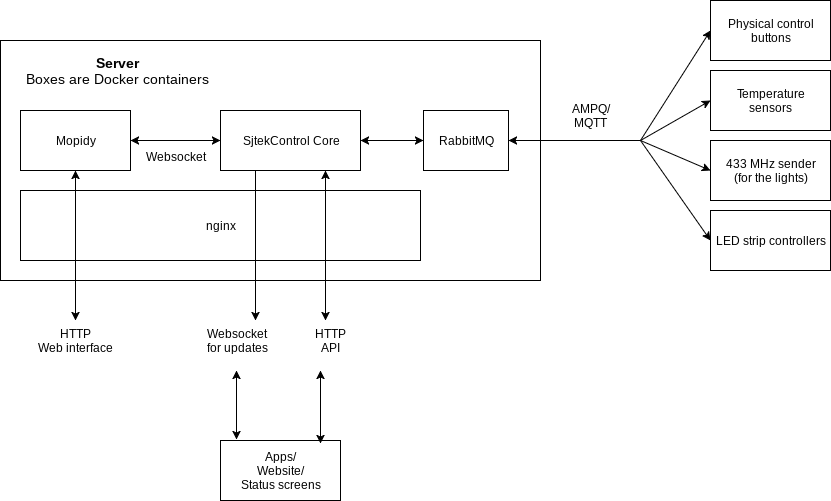

# Sjtek Control

This is the core API for Sjtek Control. An application to control some smart home devices and software.

## System overview

This projects contains two modules. `core` contains the API and `data` contains a client side library.

## Clients
* **Android**
  https://github.com/Sjtek/sjtekclient-android

* **iOS**
  https://github.com/Sjtek/sjtekclient-ios

* **Web**
  https://github.com/Sjtek/sjtekclient-web

* **ESP2866**
  https://github.com/Sjtek/sjtekclient-button

* **Pi Client**
  https://github.com/Sjtek/sjtekcontrol-piswitch
